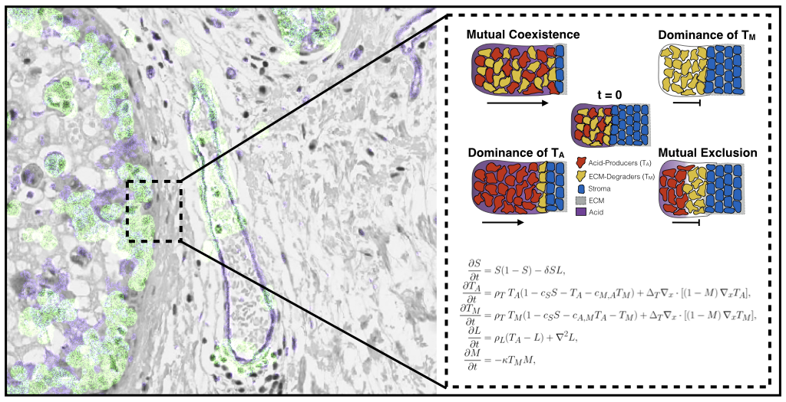

# Mix \& Match: Phenotypic coexistence as a key facilitator of cancer invasion

This repository contains the python code for numerical simulation of our PDE model from *"Mix & Match: Phenotypic coexistence as a key facilitator of cancer invasion"* [1]. All details for how to run the code, can be found in the Jupyter notebook. In addition, the notebook contains the code to generate Figures 3, 5, and 8 from the paper which illustrate the invasion dynamics of the tumour according to the model. A free pre-print of our paper can be found on the bioRxiv [2]. A short blog post explaining our key findings in lay language can be found [here](https://www.maths.ox.ac.uk/node/34984).

## References
- [1] Strobl, M. A. R., Krause, A. L., Damaghi, M., Gillies, R., Anderson, A. R. A., & Maini, P. K. (2020). Mix and Match: Phenotypic Coexistence as a Key Facilitator of Cancer Invasion. Bulletin of Mathematical Biology, 82(1). https://doi.org/10.1007/s11538-019-00675-0
- [2] Strobl et al, 2019. Mix & Match: Phenotypic coexistence as a key facilitator of cancer invasion. https://www.biorxiv.org/content/10.1101/750810v1.abstract